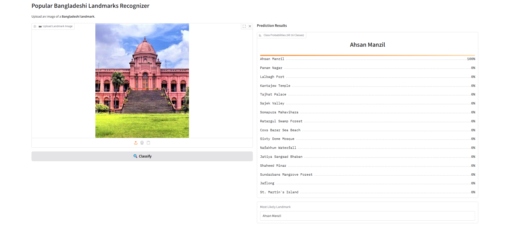

# Popular Bangladeshi Landmarks Recognizer

A **computer vision image classification system** built from **data collection → cleaning → model training → deployment → API integration**.  
The model can classify **16 different Bangladeshi landmarks** (historical and natural).

---

## 🏛️ Landmark Classes

1. Jatiya Sangsad Bhaban (Dhaka)
2. Ahsan Manzil (Dhaka)
3. Lalbagh Fort (Dhaka)
4. Shaheed Minar (Dhaka)
5. Sixty Dome Mosque (Bagerhat)
6. Somapura Mahavihara (Naogaon)
7. Kantajew Temple (Dinajpur)
8. Panam City (Sonargaon)
9. Tajhat Palace (Rangpur)
10. Cox’s Bazar Sea Beach (Chittagong)
11. St. Martin’s Island (Teknaf)
12. Sundarbans Mangrove Forest (Khulna)
13. Jaflong (Sylhet)
14. Ratargul Swamp Forest (Sylhet)
15. Sajek Valley (Rangamati)
16. Nafakhum Waterfall (Bandarban)

---

## Dataset Preparation

- **Data Collection:** Downloaded 500 images per class from DuckDuckGo.

_Notebooks available in_ `notebooks/data_prep.ipynb`.

---

## 🧹 Data Cleaning

- **90/10 split** during cleaning.
- Used **FastAI’s `ImageClassifierCleaner`** to manually verify & fix mislabeled or irrelevant samples.
- Cleaning was done **once**, after which all models were trained on the **clean dataset**.

_Details in_ `notebooks/data_cleaning.ipynb`.

---

## Training & Models

- **80% train / 10% valid / 10% test** for final training and evaluation.
- Trained multiple popular CNN and Transformer models:

  - ResNet50
  - VGG19
  - EfficientNet-B0
  - DenseNet121

- **Fine-tuning:** 3 epochs per model with FastAI’s transfer learning.
- Used **validation set** for model selection.
- Saved each model as both `.pth` and `.pkl`.

_Training pipeline in_ `notebooks/training.ipynb`.

## Evaluation

- Final evaluation on **test set**:
  - Confusion Matrix
  - Classification Report (precision, recall, F1-score)

_Comparison results in_ `notebooks/Test Evaluation.ipynb`.

---

### 🔹 Model Performance Summary

| Model           | Final Validation Accuracy | Final Validation Loss | Training Time (per epoch) |
| --------------- | ------------------------- | --------------------- | ------------------------- |
| EfficientNet-B0 | **96.3%**                 | 0.1331                | ~2m 44s                   |
| DenseNet121     | **98.7%**                 | 0.0633                | ~3m 02s                   |
| VGG19_bn        | **99.1%**                 | 0.0359                | ~3m 19s                   |
| ResNet50        | **98.8%**                 | 0.0525                | ~2m 55s                   |

---

### Observations

- **EfficientNet-B0**:

  - Lightweight and fast.
  - Achieved **96.3% accuracy**, but underperformed compared to heavier models.
  - Good baseline, ideal for deployment where inference speed is critical.

- **DenseNet121**:

  - Strong performance (**98.7% accuracy**).
  - Good balance between depth, accuracy, and efficiency.

- **VGG19_bn**:

  - Achieved the **highest validation accuracy (99.1%)**.
  - Slightly slower, but its deep layered architecture captured landmark features very well.
  - Chosen as the **final deployed model**.

- **ResNet50**:
  - Very competitive (**98.8% accuracy**) with low validation loss (0.0525).
  - Stable training and strong generalization.
  - Could also serve as a good deployment choice if performance vs. efficiency trade-off is considered.

---

### Best Model

- **VGG19_bn** was chosen for final deployment.
- Delivered the **highest validation accuracy (99.1%)** and **lowest error rate**.
- **test set accuracy ~99%**, confusion matrix, and classification report.

## 🚀 Deployment

- Exported best model as `.pkl`.
- Deployed the best model with **Gradio + HuggingFace Spaces**.
- Try it here 👉 [Live Demo](https://huggingface.co/spaces/yeager07/popular-bangladeshi-landmark-recognizer)



---

## 🌐 API & GitHub Pages Integration

Built a companion **GitHub Pages website**:

- `index.md` → project description
- `landmarks_recognizer.html` → Gradio client script for inference
- `_config.yml` → theme config
- `custom.css` → styling
- Users can upload an image → API returns prediction directly on the site.

Check it here 👉 [GitHub Pages Site](https://07fahim.github.io/Popular-Bangladeshi-Landmarks-Recognizer/)

---

# Bangladeshi-Landmarks

```
Bangladeshi-Landmarks/
│── notebooks/          # Jupyter notebooks (cleaning, training, evaluation)
│── deployment/         # Gradio app + HuggingFace deployment
│── docs/              # GitHub Pages website (index.md, config, assets)
│── models/            # Trained models (.pkl, .pth)
│── data/              # dataset
│── README.md          # Project documentation
```

### End-to-End Pipeline

**Dataset collection → Cleaning → Model training → Evaluation → Best model selection → Deployment → Web integration**

## License

This project is licensed under the **MIT License**.  
See the [LICENSE](LICENSE) file for details.

---

## Acknowledgments

- **Data Collection:** DuckDuckGo Search (image scraping)
- **Stack:** Python, FastAI, PyTorch, Gradio, HuggingFace Spaces, Jupyter
- **Deployment:** GitHub Pages + Gradio JS client
- Thanks to the **open-source community** for the amazing tools and libraries

---

## Badges

[](https://www.python.org/)  
[](https://docs.fast.ai/)  
[](https://pytorch.org/)  
[](https://huggingface.co/spaces/yeager07/popular-bangladeshi-landmark-recognizer)  
[](https://gradio.app/)  
[](https://github.com/07fahim/Popular-Bangladeshi-Landmarks-Recognizer)  
[](LICENSE)
