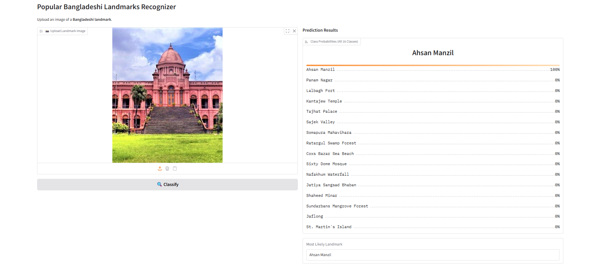

# Popular Bangladeshi Landmarks Recognizer

## Table of Contents

- [Overview](#overview)
- [Landmark Classes](#landmark-classes)
- [Dataset Preparation](#dataset-preparation)
- [Data Cleaning](#data-cleaning)
- [Training & Models](#training--models)
- [Evaluation](#evaluation)
  - [Model Performance Summary](#model-performance-summary)
  - [Observations](#observations)
  - [Best Model](#best-model)
- [Deployment](#deployment)
- [API & GitHub Pages Integration](#api--github-pages-integration)
- [Project Structure](#project-structure)
- [Usage](#usage)
  - [Run Locally with Gradio](#run-locally-with-gradio)
  - [Train Models Locally](#train-models-locally)
  - [API Integration](#api-integration)
- [License](#license)
- [Acknowledgments](#acknowledgments)

## Overview

A computer vision image classification system built from data collection → cleaning → model training → deployment → API integration. The model can classify 16 different Bangladeshi landmarks (historical and natural).

## 🏛️ Landmark Classes

1. **Jatiya Sangsad Bhaban** (Dhaka)
2. **Ahsan Manzil** (Dhaka)
3. **Lalbagh Fort** (Dhaka)
4. **Shaheed Minar** (Dhaka)
5. **Sixty Dome Mosque** (Bagerhat)
6. **Somapura Mahavihara** (Naogaon)
7. **Kantajew Temple** (Dinajpur)
8. **Panam City** (Sonargaon)
9. **Tajhat Palace** (Rangpur)
10. **Cox's Bazar Sea Beach** (Chittagong)
11. **St. Martin's Island** (Teknaf)
12. **Sundarbans Mangrove Forest** (Khulna)
13. **Jaflong** (Sylhet)
14. **Ratargul Swamp Forest** (Sylhet)
15. **Sajek Valley** (Rangamati)
16. **Nafakhum Waterfall** (Bandarban)

## 📂 Dataset Preparation

- **Data Collection**: Scraped ~1,050 images per class for **16 Bangladeshi landmarks** using DuckDuckGo.
- **Total Collected**: ~16,800 images before cleaning.
- Notebooks available in `notebooks/data_prep.ipynb`.

## 🧹 Data Cleaning

- **Reason for Cleaning**: Since images were collected from the web, many were noisy, irrelevant, or mislabeled.
- **Process**: Used FastAI's `ImageClassifierCleaner` to manually verify and remove incorrect samples.
- **Result**: After cleaning, the final dataset contained **16,741 high-quality images**.
- **Test Set**: Created a separate **test folder** with **1,668 images** (10% stratified sampling of cleaned dataset).
- Notebooks available in `notebooks\landmarks_dataset_test_split.ipynb`

- **Final Split**:
  - Training: ~80%
  - Validation: ~10%
  - Test: ~10%
- **Data Augmentation**: Applied GPU-accelerated augmentations (FastAI `aug_transforms`), including:

  - Random resized crop
  - Rotation
  - Flips (horizontal/vertical)
  - Zooming & warping

- Details of cleaning pipeline in `notebooks/data_cleaning.ipynb`.

## Training & Models

- **80% train / 10% valid / 10% test** for final training and evaluation.
- Trained multiple popular CNN models:
  - **ResNet50**
  - **VGG19_bn**
  - **EfficientNet-B0**
  - **DenseNet121**
- **Fine-tuning**: 3 epochs per model with FastAI's transfer learning.
- Saved each model as both `.pth` and `.pkl`.
- Training pipeline in `notebooks/training.ipynb`.

## Evaluation

Final evaluation on the **held-out test set** included:

- **Confusion Matrix**
- **Classification Report** (precision, recall, F1-score)
- Comparison of validation and test accuracy.

### 🔹 Model Performance Summary

| Model           | Final Validation Accuracy | Final Validation Loss | Training Time (per epoch) |
| --------------- | ------------------------- | --------------------- | ------------------------- |
| ResNet50        | 99.7%                     | 0.0065                | ~5m 46s                   |
| EfficientNet-B0 | 99.3%                     | 0.0260                | ~5m 42s                   |
| DenseNet121     | 99.9%                     | 0.0024                | ~6m 06s                   |
| VGG19_bn        | 99.8%                     | 0.0075                | ~5m 59s                   |

### Observations

**ResNet50**

- Very strong performance with **99.7% accuracy**.
- Stable training and excellent generalization.

**EfficientNet-B0**

- Lightweight and efficient.
- Slightly lower accuracy (99.3%) but still a great balance of speed and performance.

**DenseNet121**

- Achieved the **highest accuracy (99.9%)** with lowest validation loss.
- Strong generalization, stable training, and efficient feature extraction.
- **Chosen as the final deployment model**.

**VGG19_bn**

- Very competitive (99.8%) and close to DenseNet121.
- Slightly slower to train due to its size but still excellent.

### 🏆 Best Model

- **DenseNet121** was chosen for deployment.
- Delivered **99.9% validation accuracy**, **lowest loss (0.0024)**, and stable test set accuracy (~99%).
- Exported and deployed using **Gradio + HuggingFace Spaces**, integrated with **GitHub Pages API frontend**.

## 🚀 Deployment

- Exported best model as `.pkl`.
- Deployed the best model with Gradio + HuggingFace Spaces.
- **Try it here** 👉 [Live Demo](https://huggingface.co/spaces/yeager07/popular-bangladeshi-landmark-recognizer)



## 🌐 API & GitHub Pages Integration

Built a companion GitHub Pages website:

- `index.md` → project description
- `landmarks_recognizer.html` → Gradio client script for inference
- `_config.yml` → theme config
- `custom.css` → styling

Users can upload an image → API returns prediction directly on the site.

**Check it here** 👉 [GitHub Pages Site](https://07fahim.github.io/Popular-Bangladeshi-Landmarks-Recognizer/)

## Project Structure

```
Bangladeshi-Landmarks/
│── notebooks/          # Jupyter notebooks (cleaning, training, evaluation,inference)
│── deployment/         # Gradio app + HuggingFace deployment
│── docs/              # GitHub Pages website (index.md, config, assets)
│── models/            # Trained models (.pkl, .pth)
│── data/              # dataset
│── README.md          # Project documentation
```

### End-to-End Pipeline

Dataset collection → Cleaning → Model training → Evaluation → Best model selection → Deployment → Web integration

## Usage

### Run Locally with Gradio

1. **Clone the repository**:

   ```bash
   git clone https://github.com/07fahim/Popular-Bangladeshi-Landmarks-Recognizer.git
   cd Popular-Bangladeshi-Landmarks-Recognizer
   ```

2. **Set up a virtual environment and install dependencies**:

   ```bash
   python -m venv venv
   source venv/bin/activate  # On Windows: venv\Scripts\activate
   pip install fastai==2.8.4 gradio==5.44.1
   ```

3. **Ensure the trained model** (`densenet121.pkl`) is in the `models/` folder.

4. **Run the Gradio app**:

   ```bash
   python deployment/app.py
   ```

5. **Open the provided URL** (e.g., `http://127.0.0.1:7860`) in a browser and upload an image to classify.

### Train Models Locally

1. Ensure the dataset is in the `data/` folder (run `notebooks/data_prep.ipynb` to collect images if needed).
2. Clean the dataset using `notebooks/data_cleaning.ipynb` with FastAI's `ImageClassifierCleaner`.
3. Clean dataset test split `notebooks\landmarks_dataset_test_split.ipynb`.
4. Train models using `notebooks/training.ipynb` (GPU recommended).
5. Evaluate performance with `notebooks/Test Evaluation.ipynb` to view confusion matrices and classification reports.
6. Instead of retraining load the pretrained model directly using,`notebooks/Inference.ipynb` for quick predictions:

### API Integration

Use the Gradio API hosted on HuggingFace Spaces for predictions in your application:

```python
from gradio_client import Client

client = Client("https://huggingface.co/spaces/yeager07/popular-bangladeshi-landmark-recognizer")
result = client.predict(image="path/to/your/image.jpg")
print(result)  # Predicted landmark
```

Check `docs/landmarks_recognizer.html` for the client-side JavaScript implementation.

## License

This project is licensed under the MIT License. See the [LICENSE](LICENSE) file for details.

## Acknowledgments

- **Data Collection**: DuckDuckGo Search (image scraping)
- **Stack**: Python, FastAI, PyTorch, Gradio, HuggingFace Spaces, Jupyter
- **Deployment**: GitHub Pages + Gradio JS client
- Thanks to the open-source community for the amazing tools and libraries!

## Badges

[](https://www.python.org/)  
[](https://docs.fast.ai/)  
[](https://pytorch.org/)  
[](https://huggingface.co/spaces/yeager07/popular-bangladeshi-landmark-recognizer)  
[](https://gradio.app/)  
[](https://github.com/07fahim/Popular-Bangladeshi-Landmarks-Recognizer)  
[](LICENSE)
